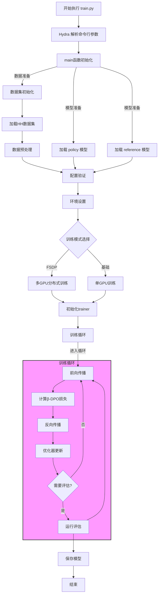

<!-- @import "[TOC]" {cmd="toc" depthFrom=1 depthTo=6 orderedList=false} -->

<!-- code_chunk_output -->

- [基线β-DPO方法推导](#基线β-dpo方法推导)
  - [1. 基础设定](#1-基础设定)
  - [2. 偏好数据集定义](#2-偏好数据集定义)
  - [3. DPO 基础公式](#3-dpo-基础公式)
  - [4. β-DPO 的核心创新](#4-β-dpo-的核心创新)
    - [a) 个体奖励差异定义](#a-个体奖励差异定义)
    - [b) 动态 β 校准](#b-动态-β-校准)
    - [c) β引导的数据过滤](#c-β引导的数据过滤)
  - [5. 训练流程](#5-训练流程)
  - [代码实现的角度深入理解beta-DPO](#代码实现的角度深入理解beta-dpo)
  - [执行命令机器流程图](#执行命令机器流程图)

<!-- /code_chunk_output -->


# 基线β-DPO方法推导

本文档介绍了基线β-DPO方法的数学原理与实现细节。 主要优势
1. 自适应性: 动态调整 β 以适应不同质量的数据
2. 鲁棒性: 通过数据过滤机制减少异常值影响
3. 简单高效: 不需要额外的黄金模型进行数据过滤
4. 模型无关: 可以作为即插即用模块与其他 DPO 改进兼容 

## 1. 基础设定
- 输入: 文本序列(prompt) $\mathbf{x}$
- 输出: 响应序列 $\mathbf{y} = [y_1, y_2, ..., y_N]$
- 自回归语言模型 $\pi$ 的生成概率:

$$\pi(\mathbf{y}|\mathbf{x}) = \prod_{t=1}^{N}\pi(y_t|\mathbf{x}, \mathbf{y}_{<t})$$

## 2. 偏好数据集定义
- 数据集 $\mathcal{D} = \{(\mathbf{x}^{(i)}, \mathbf{y}_w^{(i)}, \mathbf{y}_l^{(i)})\}_{i=1}^M$
- 每个三元组包含:
  - prompt $\mathbf{x}$
  - 优选响应 $\mathbf{y}_w$ 
  - 次选响应 $\mathbf{y}_l$
- 偏好标注 $o(\mathbf{y}_w \succ \mathbf{y}_l|\mathbf{x}) \in \{0,1\}$

## 3. DPO 基础公式
- DPO 损失函数:

$$\ell_{\text{DPO}}(\mathbf{x},\mathbf{y}_w,\mathbf{y}_l;\theta;\pi_{\text{ref}}) = -\log \sigma(\beta[\log(\frac{\pi_\theta(\mathbf{y}_w|\mathbf{x})}{\pi_{\text{ref}}(\mathbf{y}_w|\mathbf{x})}) - \log(\frac{\pi_\theta(\mathbf{y}_l|\mathbf{x})}{\pi_{\text{ref}}(\mathbf{y}_l|\mathbf{x})})])$$

其中:
- $\pi_{\text{ref}}$ 是参考模型
- $\beta$ 是 KL 散度的惩罚系数
- $\sigma$ 是 logistic 函数

## 4. β-DPO 的核心创新

### a) 个体奖励差异定义
对每个三元组 $(\mathbf{x}^{(i)}, \mathbf{y}_w^{(i)}, \mathbf{y}_l^{(i)})$:

$$M_i = r(\mathbf{y}_w^{(i)};\mathbf{x}^{(i)}) - r(\mathbf{y}_l^{(i)};\mathbf{x}^{(i)})$$

### b) 动态 β 校准
批次级别的 β 计算:

$$\beta_{\text{batch}} = [1 + \alpha(\mathbb{E}[M_i] - M_0)]\beta_0$$

其中:
- $\beta_0$ 是基准超参数(通常为0.1)
- $\alpha$ 是缩放因子 $[0,1]$
- $M_0$ 是阈值,通过移动平均更新:

$$M_0 \leftarrow mM_0 + (1-m)\mathbb{E}[M_i]$$

### c) β引导的数据过滤
基于概率模型评估每个三元组的重要性:

$$p(M_i) = \frac{1}{\sqrt{2\pi}\sigma} \exp(-\frac{(M_i-M_0)^2}{2\sigma^2})$$

σ 通过移动平均更新:

$$\sigma \leftarrow m\sigma + (1-m)\sqrt{\mathbb{V}[M_i]}$$

## 5. 训练流程
1) 对每个批次:
   - 计算个体奖励差异 $M_i$
   - 更新 $M_0$ 和 $\sigma$
   - 计算批次级别的 $\beta_{\text{batch}}$
   - 基于 $p(M_i)$ 过滤数据
2) 使用过滤后的数据和动态 $\beta$ 计算 DPO 损失
3) 更新模型参数

## 代码实现的角度深入理解beta-DPO


从目录结构来看，beta-DPO 的核心文件有：
1. `trainers.py` (33KB) - 最大的文件，应该包含了核心训练逻辑和 DPO 损失实现
2. `preference_datasets.py` (17KB) - 偏好数据集的处理
3. `train.py` (5KB) - 训练入口
4. `utils.py` (6.4KB) - 工具函数
5. `config/` - 配置文件目录

从 `baseline.md` 中我们可以了解到：
1. 支持的数据集：Anthropic-HH、Stanford-HH 等
2. 主要评估指标：
   - Preference Accuracy
   - Reference KL
   - Win Rate
3. 典型实验配置：
   - GPT2-Large + Anthropic-HH
   - LLaMA-7B + Stanford-HH

让我先深入看看 `trainers.py`，因为这里应该包含了与数学公式对应的核心实现：

Read file: beta-DPO/trainers.py


从代码结构来看，最关键的几个部分是：

1. `preference_loss` 函数 - 这就是我们数学公式中的 DPO 损失函数实现
2. `BasicTrainer` 类 - 包含了训练的主要逻辑
3. `get_batch_metrics` 方法 - 计算批次级别的指标，可能包含了β的动态调整

让我们先看看 `preference_loss` 函数的具体实现：

Read file: beta-DPO/trainers.py


## 执行命令机器流程图
```bash
python -u train.py \
    model=internlm2 \
    datasets=[hh] \
    loss=dpo \
    loss.beta=0.1 \
    exp_name=internlm2_beta_dpo \
    gradient_accumulation_steps=2 \
    batch_size=64 \
    eval_batch_size=32 \
    trainer=FSDPTrainer \
    sample_during_eval=false \
    model.fsdp_policy_mp=bfloat16 \
    model.name_or_path="/share/new_models/Shanghai_AI_Laboratory/internlm2_5-1_8b-chat" \
    model.archive="PATH_TO_SFT_CHECKPOINT/LATEST/policy.pt" \
    loss.mode_loss=beta_DPO \
    loss.mode_weight=0.2 \
    loss.a=0.6
```




数据准备
- 通过 datasets=[hh] 指定使用 Anthropic Helpful and Harmless 数据集
- 数据集通过 HuggingFace datasets 库自动下载和缓存
- 数据处理流程：
  * 加载原始数据
  * 提取偏好对（chosen/rejected responses）
  * tokenization 处理
  * 数据集切分（训练集/验证集）
- 数据缓存位置由 local_dirs 配置决定
